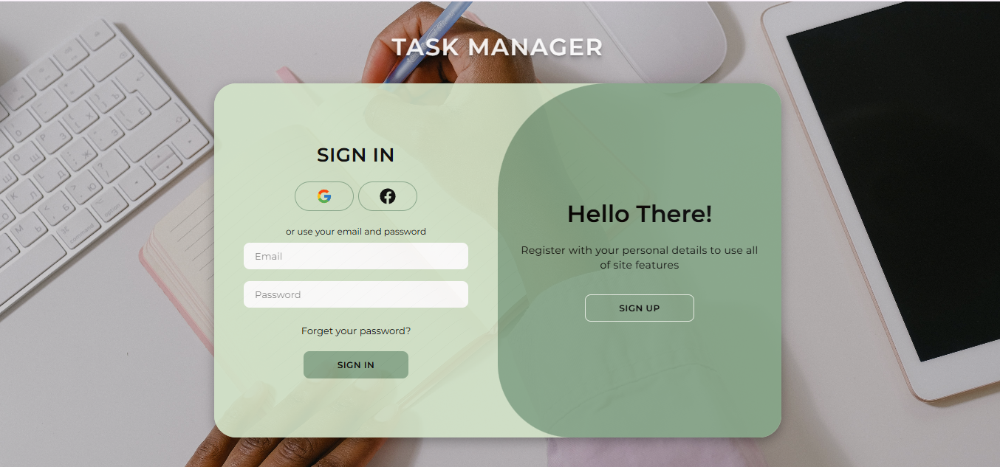
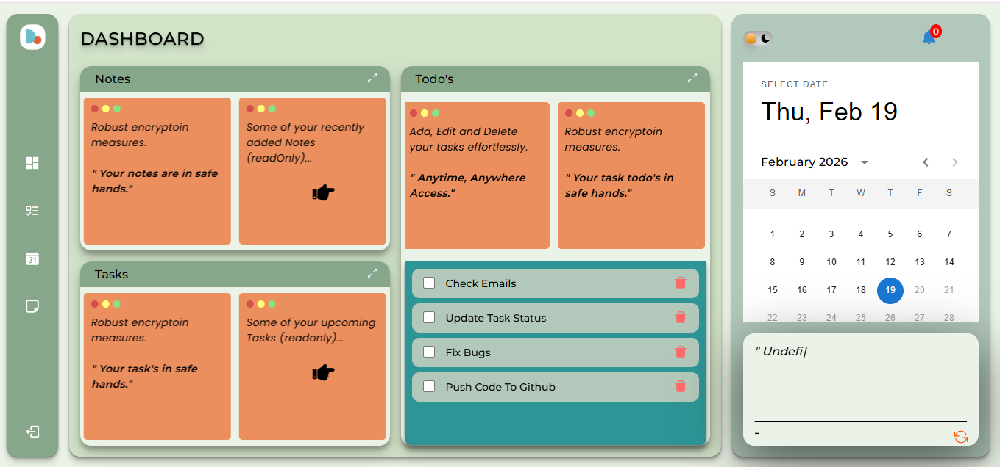
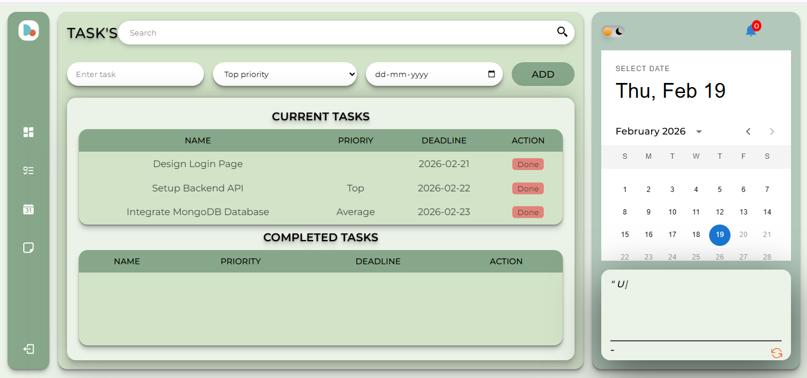
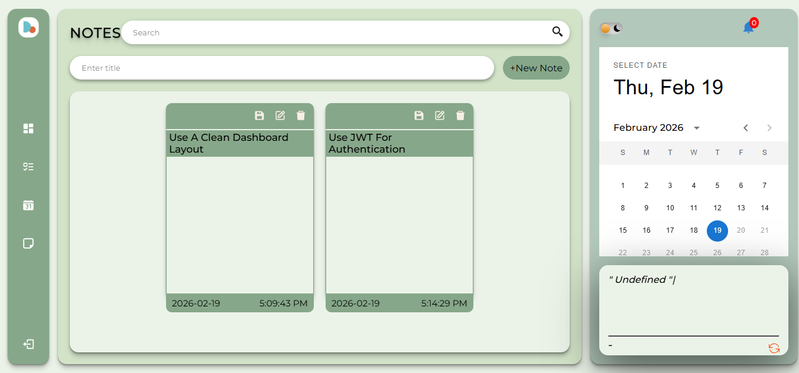
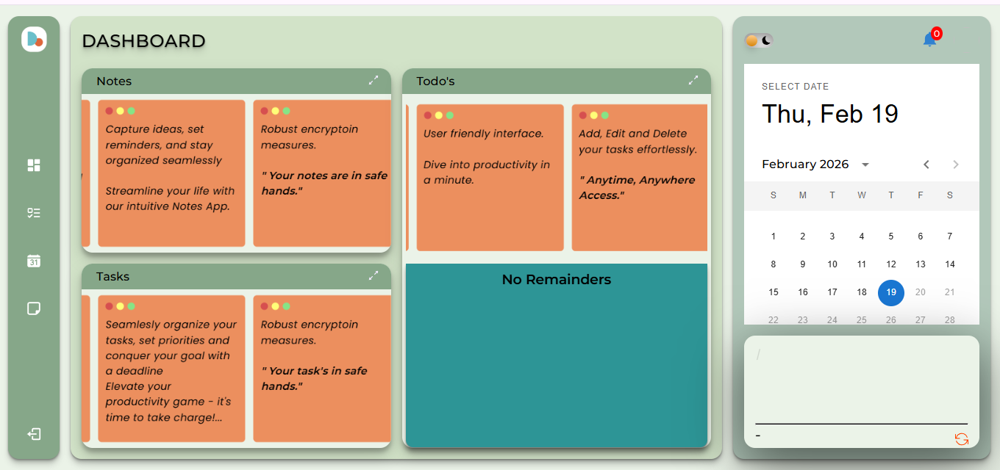

# MERN Stack Task Manager App

A full-stack Task Manager application built with the MERN stack (MongoDB, Express.js, React, Node.js). Features user authentication, task management, notes, todos, and calendar integration.

---

## 🌐 Live Demo

| Component | URL |
|-----------|-----|
| **Frontend** | [https://mern-stack-task-manager-app.vercel.app](https://mern-stack-task-manager-app.vercel.app) |
| **Backend API** | [https://task-manager-backend-wm5h.onrender.com](https://task-manager-backend-wm5h.onrender.com) |
| **GitHub** | [https://github.com/Mamta-gangwar/MERN-Stack-Task-Manager-App](https://github.com/Mamta-gangwar/MERN-Stack-Task-Manager-App) |

---

## ✨ Features

- ✅ User Authentication (Local, Google, Facebook)
- ✅ Task Management (Create, Edit, Delete, Track)
- ✅ Notes (Save and organize notes)
- ✅ Todo Lists (Create and manage todos)
- ✅ Calendar View (Interactive calendar)
- ✅ Dark Mode (Light/Dark theme toggle)
- ✅ Password Reset (Email integration)
- ✅ User Profile (View and manage profile)

---

## 🛠️ Tech Stack

**Frontend:**
- React.js
- React Router
- CSS3
- Deployed on Vercel

**Backend:**
- Node.js
- Express.js
- MongoDB Atlas
- Passport.js (Authentication)
- Nodemailer (Email)
- Deployed on Render

## 🚀 Quick Start

### Visit Live App
Go to: **https://mern-stack-task-manager-app.vercel.app**

### Run Locally

**Step 1: Clone the repository**
git clone https://github.com/Mamta-gangwar/MERN-Stack-Task-Manager-App.git
cd MERN-Stack-Task-Manager-App

text

**Step 2: Setup Backend**
cd BackEnd
npm install

text

Create `.env` file in BackEnd folder:
MONGO_URL=your_mongodb_connection_string
SESSION_SECRET=your_secret
JWT_SECRET_KEY=your_jwt_secret
FRONTEND_DOMAIN=http://localhost:3000

text

Start backend:
npm start

text

**Step 3: Setup Frontend** (Open new terminal)
cd FrontEnd
npm install
npm start

text

**Access your app:**
- Frontend: http://localhost:3000
- Backend: http://localhost:8080

---

## 📸 Screenshots

| Login Page | Dashboard | Tasks |
|:----------:|:---------:|:-----:|
|  |  |  |

| Notes | Dashboard View 2 | Features |
|:-----:|:----------------:|:--------:|
|  |  |  |

---

## 📁 Project Structure
MERN-Stack-Task-Manager-App/
│
├── BackEnd/
│ ├── Models/
│ ├── Routes/
│ ├── index.js
│ └── package.json
│
├── FrontEnd/
│ ├── public/
│ ├── src/
│ │ ├── components/
│ │ ├── App.js
│ │ └── index.js
│ └── package.json
│
├── images/
│ ├── Login.png
│ ├── Dashboard1.png
│ ├── Dashboard2.png
│ ├── Tasks.png
│ └── Notes.png
│
└── README.md

text

---

## 🔄 How It Works
User → Frontend (React) → API Call → Backend (Node.js) → Database (MongoDB)
↑ │
└────────────────── Response ────────────────────────────┘

text

---

## 🔧 Environment Variables

**Backend (.env file)**
MONGO_URL=your_mongodb_connection_string
SESSION_SECRET=your_session_secret
JWT_SECRET_KEY=your_jwt_secret
FRONTEND_DOMAIN=http://localhost:3000

text

**Frontend (.env file)**
REACT_APP_API_URL=http://localhost:8080

text

---

## 📞 Contact

**Mamta Gangwar**

- GitHub: [@Mamta-gangwar](https://github.com/Mamta-gangwar)
- Project Link: [https://github.com/Mamta-gangwar/MERN-Stack-Task-Manager-App](https://github.com/Mamta-gangwar/MERN-Stack-Task-Manager-App)

---

⭐ **If you like this project, please give it a star on GitHub!**